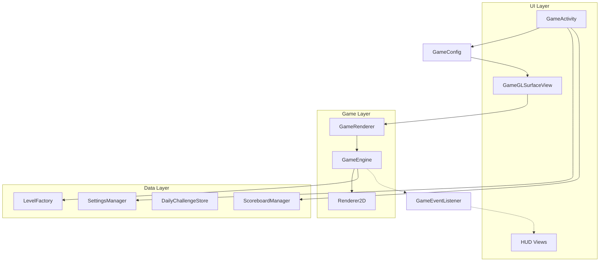

# Breakout+ Architecture

## High-Level Overview
- Rendering: OpenGL ES 2.0 via `GLSurfaceView`.
- Game loop: `GameRenderer` drives update/render at continuous rate.
- Core gameplay: `GameEngine` handles physics, collisions, levels, and powerups.
- UI: Activities + XML layouts with foldable variants in `layout-sw600dp`.
- Foldable support: `FoldAwareActivity` adds hinge-aware padding via WindowManager.

## Main Modules
- UI Activities: `app/src/main/java/com/breakoutplus/*.kt` (includes `DailyChallengesActivity`, `PrivacyActivity`)
- Game Logic: `app/src/main/java/com/breakoutplus/game/*.kt`
- Data: `SettingsManager`, `ScoreboardManager`, `DailyChallengeStore`
- Resources: `app/src/main/res/`
- Audio generation: `tools/generate_sfx.py`

## Data Flow
1. `GameActivity` creates `GameConfig` from `GameMode` + settings.
2. `GameGLSurfaceView` starts `GameRenderer` with config.
3. `GameRenderer` runs the loop:
   - `update(dt)` in `GameEngine`
   - `render(renderer2D)` with `Renderer2D`
4. `GameEngine` emits events through `GameEventListener` to update HUD and end screens.

## State Management
- `GameState`: READY, RUNNING, PAUSED, GAME_OVER.
- `GameMode`: controls base lives, timer, and special rules.
- `SettingsManager`: persistent settings via SharedPreferences.
- `ScoreboardManager`: stores top scores (JSON) in SharedPreferences.
- `DailyChallengeStore`: daily challenge state and progress (local).

## Rendering Pipeline
- Orthographic projection in `Renderer2D`.
- Rect mesh for bricks/paddle/powerups, circle mesh for balls/particles.
- Themes provide color palettes per level.

## Foldable Strategy
- `layout-sw600dp` overrides for unfolded state.
- `FoldAwareActivity` reads `WindowLayoutInfo` and adds hinge padding.

## Performance
- Continuous render loop.
- Delta time clamped to avoid large jumps.
- Simple geometry (rects/circles) for stable GPU throughput.
